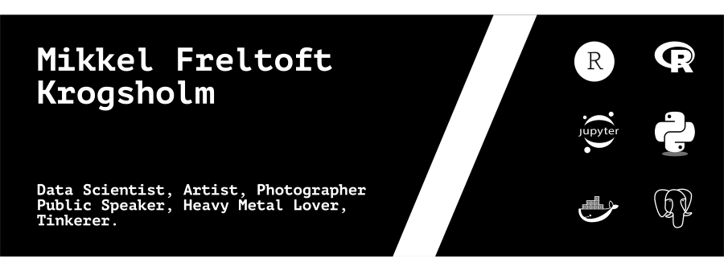

### Hi there  

 

 

 

 

## 🔭 I’m currently working on ...

Cool science stuff for Novo Nordisk where I am working as an external consultant through Teradata. 

I am reading in data from the different lab instruments and creating algorithms to automatically extract features for different molecules.

 

 

## 🌱 I’m currently learning ...

How to make Streamlit apps to communicate the cool data science that I do.

 

 

## 💬 Ask me about ...
Everything related to R. I have extensive knowledge of the language, so please reach out if you have questions.

I am also a fairly good Python programmer, so feel free to reach out in that regard too.

 

 

## 📫 How to reach me: ...

  
  

 

 

## ⚡ Fun fact: ...

I am an avid photographer and artist - and I love heavy metal.

 

 

### Tech Stack

#### Languages

   
    
    
    
    
   

#### IDEs

   
    
    
    
   

#### DevOps

   
    
    
   

#### OS

   
    
    
    
   

#### Databases

   
    
    
   

#### Frontend

   
    
    
    
    
    

   

