<div align="center">
  
</div>

<div align="center">
  <a href="https://git.io/typing-svg">
    
  </a>
</div>

<div align="center">
  
  &nbsp;&nbsp;&nbsp;
  
  &nbsp;&nbsp;&nbsp;
  
</div>

<br>

<div align="center">
  
</div>

<!-- Animated Wave -->


##  About This Viking Coder

```python
class MikkelKrogsholm:
    def __init__(self):
        self.name = "Mikkel Freltoft Krogsholm"
        self.location = "Copenhagen, Denmark 🇩🇰"
        self.current_focus = "Turning AI dreams into reality"
        self.companies = {
            "Brokk og Sindre ApS": "AI Magic for Businesses ✨",
            "Helheim ApS": "Where Metal Meets Machine Learning 🤘"
        }
        
    def current_stack(self):
        return {
            "🧠 AI/ML": ["Ollama", "LM Studio", "Hugging Face", 
                         "Mistral", "Claude", "GPT-4"],
            "🐍 Languages": ["Python", "R", "Scala", "JavaScript"],
            "🗄️ Data": ["PostgreSQL", "Elasticsearch", "Neo4j"],
            "🚀 Tools": ["Docker", "Streamlit", "Activepieces"],
            "🎸 Special": ["Heavy Metal Concert AI", "Norse Mythology"]
        }
        
    def achievements(self):
        return [
            "🏢 Led AI transformation at Teradata (7+ years)",
            "🛒 Automated IKEA's global sales forecasting",
            "💊 Advanced Novo Nordisk's bioinformatics",
            "🤖 Trusted AI advisor to major Danish companies"
        ]
```

<!-- Animated Line -->


##  What I'm Building

<div align="center">
  
  <table>
    <tr>
      <td align="center" width="33%">
        
        <h3>🤖 AI Solutions</h3>
        <p>Cutting-edge generative AI for businesses</p>
      </td>
      <td align="center" width="33%">
        
        <h3>🎸 Helheim</h3>
        <p>AI-powered metal concert platform</p>
      </td>
      <td align="center" width="33%">
        
        <h3>📊 Data Science</h3>
        <p>From insights to impact</p>
      </td>
    </tr>
  </table>
  
</div>

<!-- Tech Stack Section with Animation -->


##  Tech Arsenal

<div align="center">
  
</div>

<br>

<details>
<summary><b>🎯 Click for Detailed Tech Stack</b></summary>
<br>


</details>

<!-- Repository Showcase -->


##  Featured Projects

<div align="center">
  
  ### 🌟 Most Popular
  
  <table>
    <tr>
      <td align="center">
        <a href="https://github.com/mikkelkrogsholm/api-mapper">
          
        </a>
      </td>
      <td align="center">
        <a href="https://github.com/mikkelkrogsholm/valgdata2022">
          
        </a>
      </td>
    </tr>
  </table>
  
  ### 🧠 AI & Automation
  
  **api-mapper** (146⭐) • **ai-prepper** (8⭐) • **AI-Editor**
  
  Leading the charge in AI-powered development tools and automation solutions.
  
  ### 📊 Data Science Ecosystem
  
  <details>
  <summary><b>🇩🇰 Danish Data Solutions</b></summary>
  
  - **statsDK** - Comprehensive R package for Statistics Denmark API
  - **geoDK** - Geographic data processing for Danish regions
  - **valgdata2022** - Election data analysis framework (11⭐)
  - **badevand** - Beach water quality monitoring API
  - **alarmeringsapp** - Emergency alert data parser
  
  </details>
  
  <details>
  <summary><b>📈 Statistical Packages</b></summary>
  
  - **billboard** - Billboard Hot 100 data (1960-2016)
  - **osrm** - Open Source Routing Machine R wrapper
  - **dbplyr3** - Database backend for dplyr
  - **nutrientprofiling** - Nutritional data analysis tools
  
  </details>
  
  ### 🚀 Open Source Contributions
  
  <div align="center">
    
    
    
  </div>
  
</div>

<!-- GitHub Stats with Style -->


##  GitHub Metrics

<div align="center">
   
  
</div>


<div align="center">
  
</div>

<!-- Trophies -->
<div align="center">
  
</div>

<!-- Professional Journey -->


##  Professional Timeline



<!-- Certifications & Contact -->


##  Credentials & Publications

<div align="center">
  
```mermaid
gitGraph
    commit id: "Started Journey"
    commit id: "Aarhus University 📚"
    branch teradata
    checkout teradata
    commit id: "Senior Data Scientist II"
    commit id: "IKEA Automation 🛒"
    commit id: "Novo Nordisk APIs 💊"
    checkout main
    merge teradata
    branch entrepreneurship
    checkout entrepreneurship
    commit id: "Founded Brokk og Sindre 🔧"
    commit id: "Founded Helheim 🤘"
    commit id: "AI Revolution 🚀"
    checkout main
    merge entrepreneurship
    commit id: "Present: AI Visionary"
```

  ### 🏆 Certifications
  
  
  
  ### 📚 Publications
  **"Kom i gang med R"** | **"EU's Forfatningstraktat og Lissabontraktaten"**
  
</div>

<!-- Connect Section -->


##  Let's Connect & Build Something Amazing!

<div align="center">
  <a href="https://www.linkedin.com/in/mikkelkrogsholm">
    
  </a>
  <a href="mailto:mikkelkrogsholm@gmail.com">
    
  </a>
  <a href="https://brokk-sindre.dk">
    
  </a>
  <a href="tel:+4530333204">
    
  </a>
</div>

<br>

<div align="center">
  
</div>

<!-- Snake Animation -->
<div align="center">
  
</div>

<!-- Footer -->


<div align="center">
  
</div>
